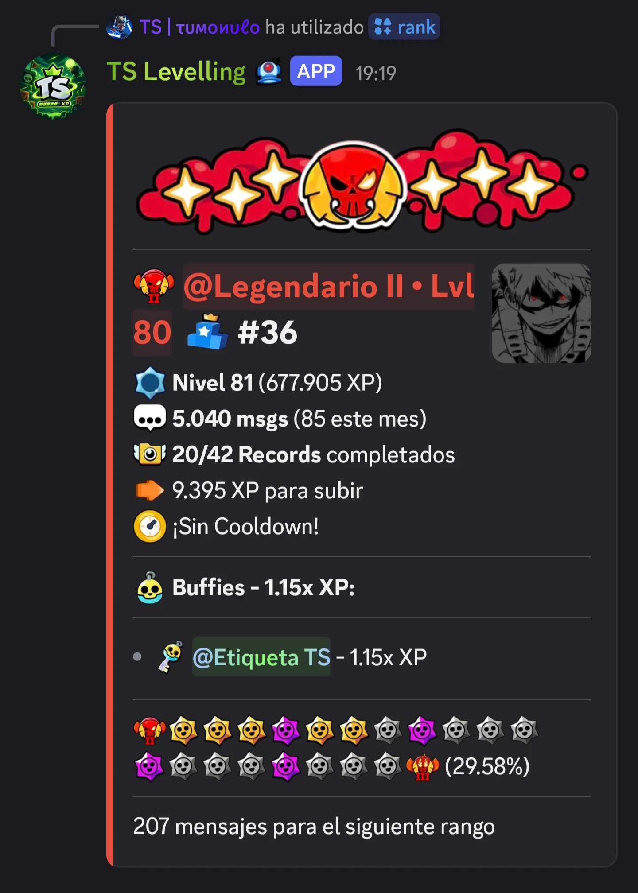
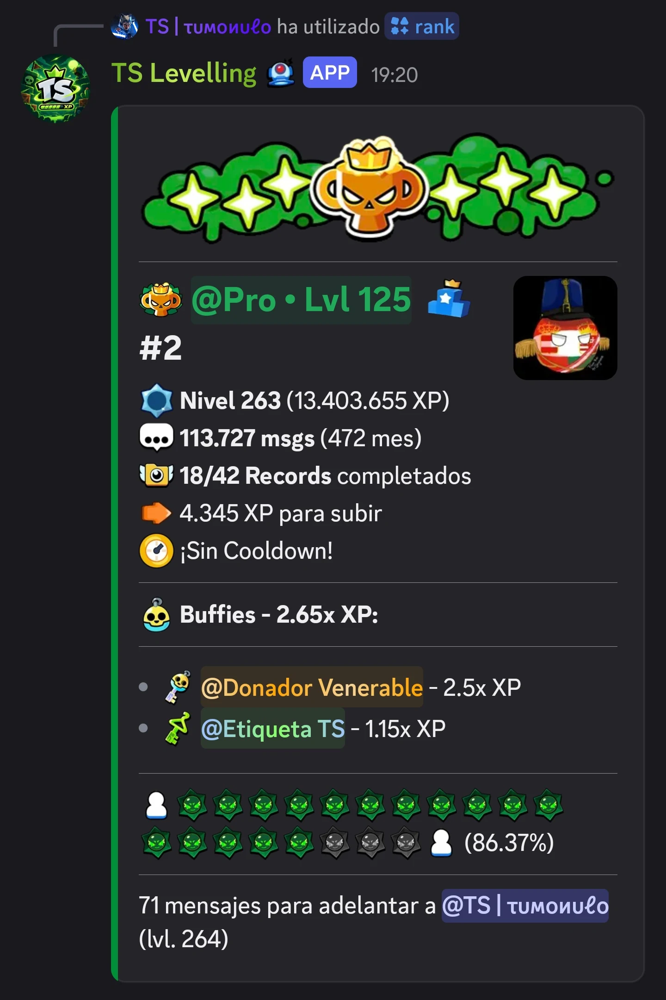
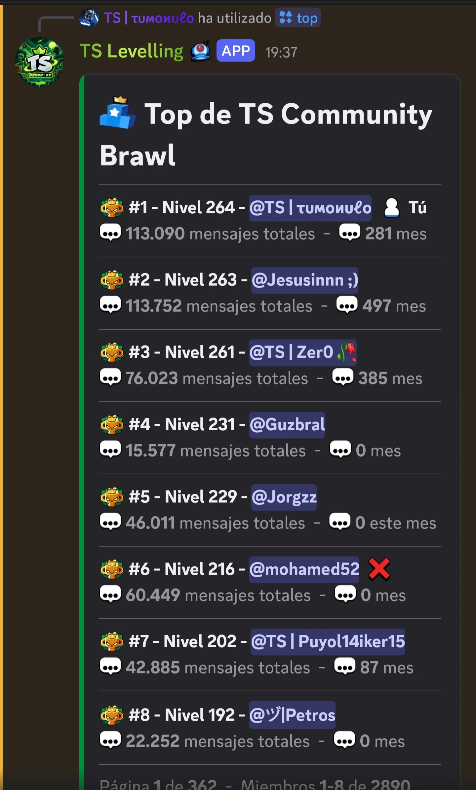
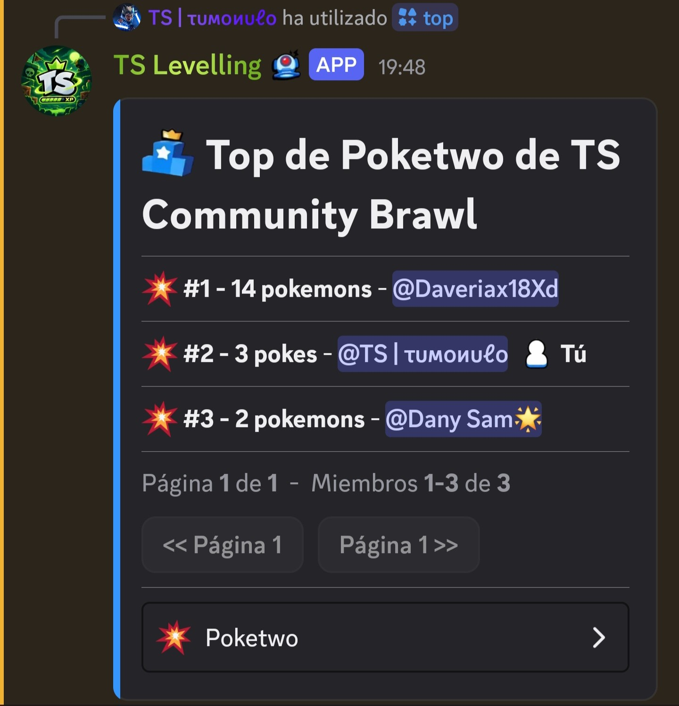
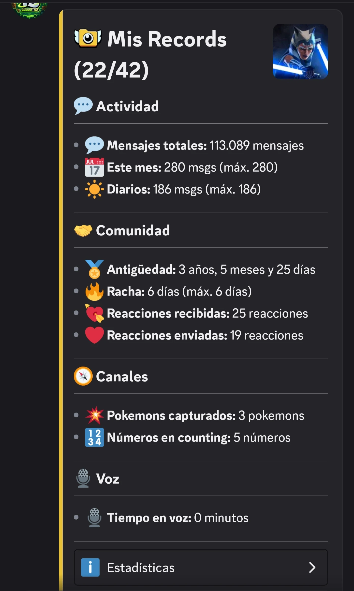
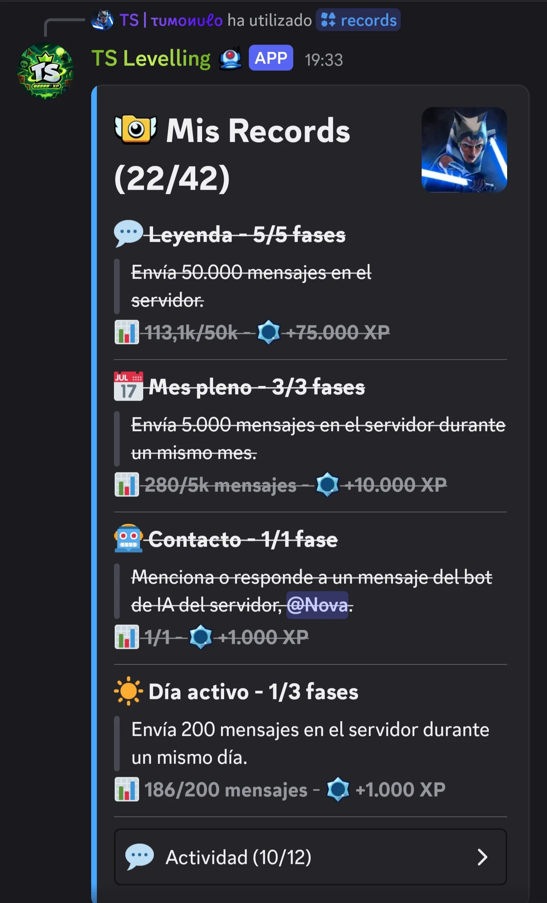
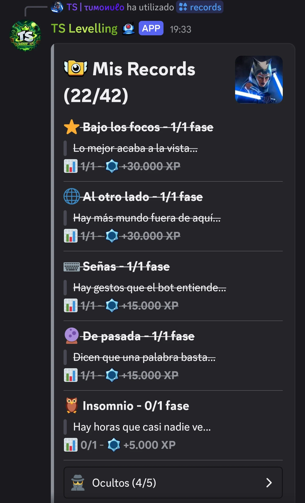
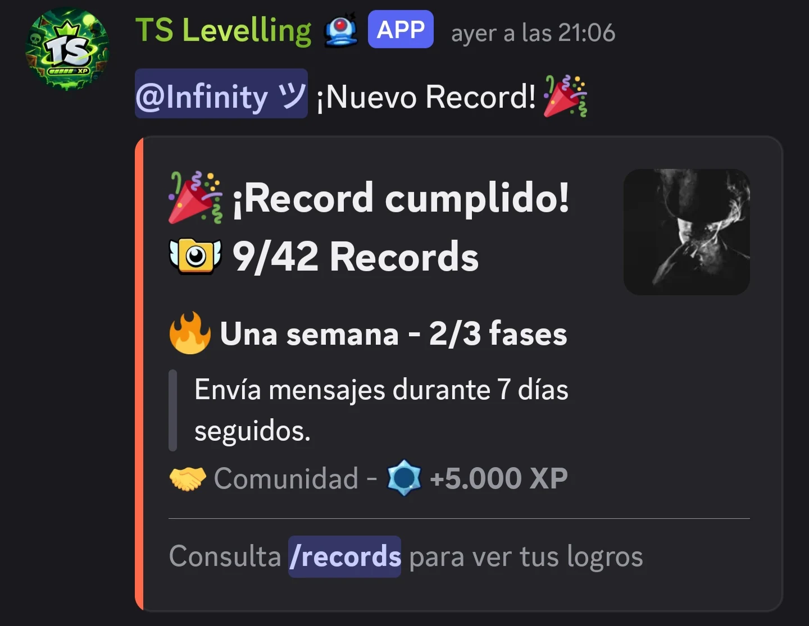
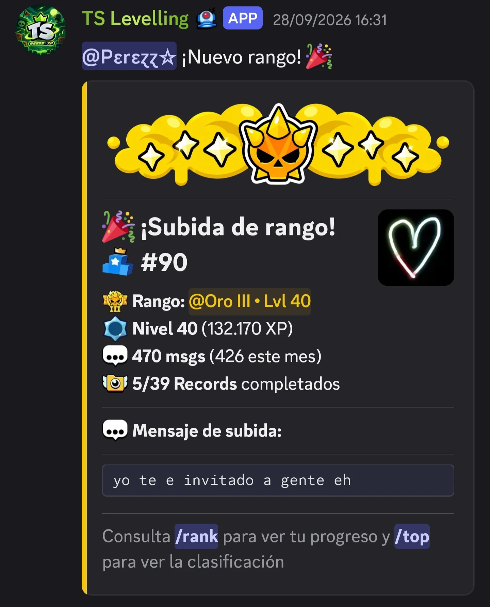
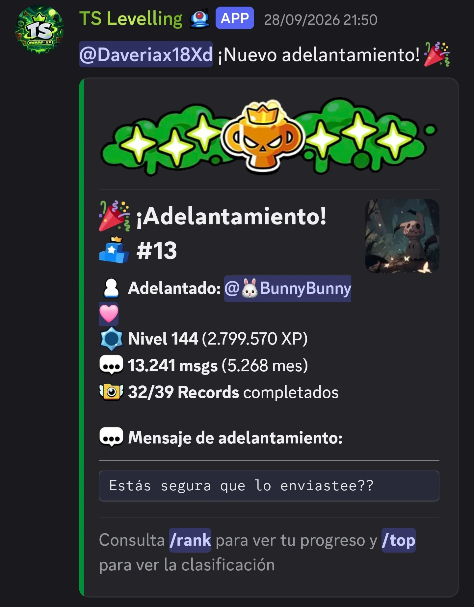

# TS-Levelling

Bot de niveles para Discord desarrollado y adaptado para **TS Community** a partir de [Polaris Open](https://github.com/GDColon/Polaris-Open).

## ✨ Características

* 📈 Sistema de experiencia y niveles basado en la actividad del servidor.
* 🏆 Rangos competitivos inspirados en Brawl Stars mediante roles de Discord.
* 🎨 Tarjetas de `/rank` personalizadas para TS Community.
* 📊 Clasificación del servidor mediante `/top`, con vistas de XP y estadísticas.
* ⭐ Sistema de **Records**: 42 logros con recompensa de XP, incluidos 5 ocultos.
* 🎉 Avisos automáticos de subida de rango, récords y adelantamientos en el top.
* ⚙️ Configuración y gestión del sistema directamente desde Discord.
* 🌐 Leaderboard web con estadísticas y records.
* 🗄️ Persistencia de datos mediante MongoDB.

## 🏆 Rangos

🥉 **Bronce I, II y III**
🥈 **Plata I, II y III**
🥇 **Oro I, II y III**
💎 **Diamante I, II y III**
🔮 **Mítico I, II y III**
🏆 **Legendario I, II y III**
👑 **Maestro I, II y III**
⭐ **Pro**

Cada rango se obtiene al alcanzar el nivel configurado para su rol dentro del servidor.

## 📇 Comando `/rank`

El comando `/rank` muestra el rango, nivel, experiencia, mensajes, posición en la clasificación, records completados y progreso hacia el siguiente rango.

Mientras el usuario puede seguir progresando, la tarjeta muestra cuánto le falta para alcanzar el siguiente rango.

  
  &nbsp;&nbsp;&nbsp;
  

La tarjeta cambia automáticamente al alcanzar **Pro**, el rango máximo. En este caso, en lugar del progreso hacia el siguiente rango, muestra cuánto le falta para adelantar al siguiente usuario de la clasificación.

## 📊 Comando `/top`

El comando `/top` muestra la clasificación del servidor, con paginación y vistas de XP total, XP del mes, XP del día y estadísticas como mensajes, rachas, reacciones, Poketwo, Counting, voz y más.

  
  &nbsp;&nbsp;&nbsp;
  

Cada estadística tiene su propio ranking, como el de XP total o el de Poketwo mostrado arriba.

## ⭐ Sistema de Records

Los **Records** son logros del servidor que otorgan experiencia al completarlos. El comando `/records` muestra las estadísticas del usuario y su progreso.

  
  &nbsp;&nbsp;&nbsp;
  

Los Records están organizados por categorías, cada una con diferentes tiers, requisitos y recompensas.

Además, existen **5 records ocultos**. Su condición no se muestra hasta que el usuario consigue descubrirlos.

  

Al completar un Record, el bot muestra un aviso en el canal de Records. Si se trata de un Record oculto, también se informa al usuario por MD.

  

## 🎉 Avisos automáticos

El bot genera avisos durante la progresión del usuario.

  
  &nbsp;&nbsp;&nbsp;
  

Al alcanzar un nuevo rango, el bot felicita al usuario mostrando su nueva tarjeta.

Cuando un usuario adelanta a otro en la clasificación, se genera un aviso de **adelantamiento**.

## 🛠️ Tecnologías

* JavaScript
* Node.js
* Discord.js
* MongoDB
* Mongoose

## 📚 Origen

Proyecto basado en [Polaris Open](https://github.com/GDColon/Polaris-Open) por Colon (GDColon), posteriormente adaptado y personalizado para TS Community Brawl.

## 📜 Licencia

Este proyecto tiene licencia dual:

* **Código base (Polaris Open):** ver fichero `LICENSE`. Uso, modificación y distribución libres para fines no comerciales, con crédito a Colon.
* **Modificaciones de TS Community (rangos, tarjetas `/rank`, `/top`, configs, assets, docs, etc.):** todos los derechos reservados, ver fichero `LICENSE-TS`. Se permite ver y estudiar el código, pero no reutilizarlo, desplegarlo ni redistribuirlo sin permiso escrito, salvo el uso autorizado en producción por TS Community.